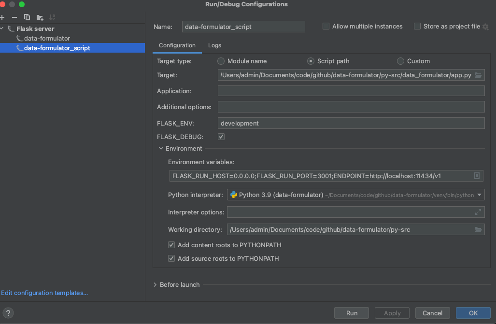

# 本地开发指南

## 配置修改
    1. 修改openai接口，使用本地模型
        修改 [client_utils.py](py-src%2Fdata_formulator%2Fagents%2Fclient_utils.py) 28行

		client = openai.OpenAI(api_key="ollama", base_url="http://localhost:11434/v1")
    2. 本地调试模式启动
      前端：
        yarn install
        yarn start
      后端： 
        python -m venv venv
        .\venv\Scripts\activate
        pip install -r requirements.txt
        
    3. 